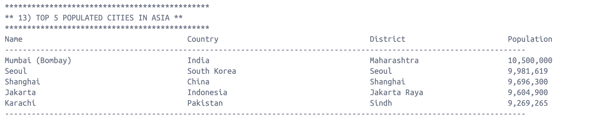

# **🚀 Population Information Reporting System**

## **📖 Project Overview**

This project focuses on developing a **Population Information Reporting System** that provides various reports based on
population data from an SQL database. The system will allow the organization to generate reports on population data at
different levels, including by country, continent, and region.

Key features include:

- **Population Reports**: Generate reports from an SQL database on various population statistics.
- **Top N Reports**: Retrieve the top N populated countries or cities globally, by continent, or by region, as defined
  by the user.
- **Continuous Integration**: Set up CI pipelines for testing and building with Maven and Docker.

---

## **⚙️ Project Setup**

### **Prerequisites**

- **Java** (JDK 17+)
- **Maven**
- **Docker**
- **Some Text**

---

## **🔍 Features and Queries**

This system supports the following 32 queries, offering detailed insights into population data at various levels.
32 requirements of 32 have been implemented, which is 100%.
Each evidence is shown as below:

### **Country Reports**

| ID | Name                                                                       | Met | Screenshot                  |
|----|----------------------------------------------------------------------------|-----|-----------------------------|
| 1  | All countries in the world organized by largest population to smallest.    | Yes |  |
| 2  | All countries in a continent organized by largest population to smallest.  | Yes |  |
| 3  | All countries in a region organized by largest population to smallest.     | Yes |  |
| 4  | Top N populated countries in the world, where N is provided by the user.   | Yes |  |
| 5  | Top N populated countries in a continent, where N is provided by the user. | Yes |  |
| 6  | Top N populated countries in a region, where N is provided by the user.    | Yes |  |

### **City Reports**

| ID | Name                                                                    | Met | Screenshot                   |
|----|-------------------------------------------------------------------------|-----|------------------------------|
| 7  | All cities in the world organized by largest population to smallest.    | Yes |   |
| 8  | All cities in a continent organized by largest population to smallest.  | Yes |   |
| 9  | All cities in a region organized by largest population to smallest.     | Yes |   |
| 10 | All cities in a country organized by largest population to smallest.    | Yes |  |
| 11 | All cities in a district organized by largest population to smallest.   | Yes |  |
| 12 | Top N populated cities in the world, where N is provided by the user.   | Yes |  |
| 13 | Top N populated cities in a continent, where N is provided by the user. | Yes |  |
| 14 | Top N populated cities in a region, where N is provided by the user.    | Yes |  |
| 15 | Top N populated cities in a country, where N is provided by the user.   | Yes |  |
| 16 | Top N populated cities in a district, where N is provided by the user.  | Yes |  |

### **Capital City Reports**

| ID | Name                                                                            | Met | Screenshot                   |
|----|---------------------------------------------------------------------------------|-----|------------------------------|
| 17 | All capital cities in the world organized by largest population to smallest.    | Yes |  |
| 18 | All capital cities in a continent organized by largest population to smallest.  | Yes |  |
| 19 | All capital cities in a region organized by largest population to smallest.     | Yes |  |
| 20 | Top N populated capital cities in the world, where N is provided by the user.   | Yes |  |
| 21 | Top N populated capital cities in a continent, where N is provided by the user. | Yes |  |
| 22 | Top N populated capital cities in a region, where N is provided by the user.    | Yes |  |

### **Population Distribution**

| ID | Name                                                                          | Met | Screenshot                   |
|----|-------------------------------------------------------------------------------|-----|------------------------------|
| 23 | Population of people living in cities vs. not living in cities, by continent. | Yes |  |
| 24 | Population of people living in cities vs. not living in cities, by region.    | Yes |  |
| 25 | Population of people living in cities vs. not living in cities, by country.   | Yes |  |

### **General Population Reports**

| ID | Name                           | Met | Screenshot                   |
|----|--------------------------------|-----|------------------------------|
| 26 | The population of the world.   | Yes |  |
| 27 | The population of a continent. | Yes |  |
| 28 | The population of a region.    | Yes |  |
| 29 | The population of a country.   | Yes |  |
| 30 | The population of a district.  | Yes |  |
| 31 | The population of a city.      | Yes |  |

### **Language Reports**

| ID | Name                                                                                                                                                                          | Met | Screenshot                   |
|----|-------------------------------------------------------------------------------------------------------------------------------------------------------------------------------|-----|------------------------------|
| 32 | Number of people who speak the following languages, ranked from greatest to smallest, including percentage of the world population: Chinese, English, Hindi, Spanish, Arabic. | Yes |  |

---